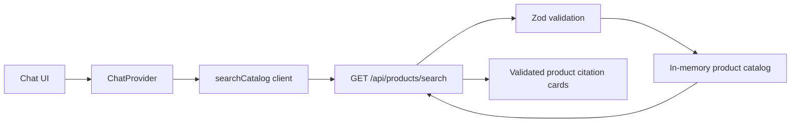

# Zava Retail Store Demo

<p align="center">
  
</p>

Zava is a responsive home-improvement storefront prototype built with the
Next.js App Router. It includes a product landing page, service cards, and a
catalog assistant that returns validated product matches with source cards.

The assistant is deterministic and searches an in-memory catalog; it does not
require an LLM, external API, database, or environment variables.

## Features

- Responsive storefront sections for featured products, popular products, and
  services
- Floating chat interface with minimize, close, typing, and error states
- Case-insensitive catalog search across product names, descriptions,
  categories, and tags
- Product citations containing an image, category, description, and price
- Client-side PNG/JPEG attachment previews up to 5 MB
- Runtime request and catalog validation with Zod
- CI checks for linting, TypeScript, and production builds

## Technology

| Area | Technology |
| --- | --- |
| Framework | Next.js 15 App Router |
| UI | React 19, Tailwind CSS 4, Heroicons |
| Language | TypeScript 5 in strict mode |
| Validation | Zod 4 |
| Package manager | npm |
| CI | GitHub Actions, Node.js 20 |

## Getting started

### Prerequisites

- Node.js 20.x
- npm 10 or later

The application lives in the `src/` directory, so run all npm commands there.

```bash
git clone https://github.com/juliamuiruri4/zava-rdt-demo.git
cd zava-rdt-demo/src
npm ci
npm run dev
```

Open [http://localhost:3000](http://localhost:3000). Select the chat icon in
the header and try a catalog query such as `paint`, `flooring`, `waterproof`,
or `ladder`.

No `.env` file is needed for the current implementation.

## Available commands

Run these commands from `src/`.

| Command | Purpose |
| --- | --- |
| `npm run dev` | Start the Turbopack development server |
| `npm run build` | Create an optimized production build |
| `npm run start` | Serve the production build |
| `npm run lint` | Run the Next.js ESLint configuration |
| `npx tsc --noEmit` | Run the same TypeScript check used in CI |

To test a production build locally:

```bash
npm run build
npm run start
```

## Architecture



1. `ChatProvider` owns the client-side message and widget state.
2. `searchCatalog` requests up to five matches and validates the response.
3. The API route validates query parameters and searches the seed catalog.
4. Search matches a normalized substring against the product name,
   description, category, and tags.
5. The UI renders the returned products as catalog source cards.

Catalog data is parsed once when the server module loads. Invalid seed data
therefore fails early instead of reaching the UI.

## Product search API

### Request

```http
GET /api/products/search?q=paint&limit=5
Accept: application/json
```

From a running local instance:

```bash
curl "http://localhost:3000/api/products/search?q=paint&limit=5"
```

| Parameter | Required | Rules |
| --- | --- | --- |
| `q` | Yes | Non-blank string, maximum 100 characters |
| `limit` | No | Integer from 1 to 50; defaults to 10 |

Unknown parameters, duplicate parameters, and invalid values return
`400 Bad Request`.

### Successful response

```json
{
  "query": "paint",
  "products": [
    {
      "id": "prod_interior_paint",
      "slug": "washable-interior-paint",
      "name": "Washable Interior Paint",
      "description": "Low-odor interior wall paint with a washable matte finish and excellent coverage.",
      "category": "paint-and-finishes",
      "price": {
        "amount": 4299,
        "currency": "USD"
      },
      "priceUnit": "each",
      "image": "/images/interior-paints-1.png",
      "href": "/products/painting/interior-paints",
      "tags": ["paint", "interior", "matte", "washable"],
      "featured": false,
      "popular": true
    }
  ],
  "total": 3,
  "limit": 5
}
```

`total` is the number of all matches; `products` contains at most `limit`
items. Successful responses use short-lived public cache headers.

### Error response

```json
{
  "error": {
    "code": "INVALID_QUERY",
    "message": "Invalid search parameters"
  }
}
```

The API uses `INVALID_QUERY` for validation failures and `INTERNAL_ERROR` for
unexpected server failures. Error responses are not cached.

## Catalog model

Products are stored in `src/app/lib/catalog/seed.ts` and validated by
`src/app/lib/catalog/schemas.ts`. Important model conventions are:

- `price.amount` is an integer in the smallest currency unit (for example,
  `4299` represents `$42.99`).
- Currency is currently limited to `USD`.
- Supported categories are `flooring`, `paint-and-finishes`, and
  `tools-and-hardware`.
- Supported price units are `each` and `square-foot`.
- Product IDs and slugs must be unique.
- Product images must use a local `/images/...` PNG, JPG, or WebP path.

### Add a catalog product

1. Add the optimized image to `src/public/images/`.
2. Add the product object to `src/app/lib/catalog/seed.ts`.
3. Use a unique `prod_...` ID and kebab-case slug.
4. Set `featured` and `popular` as needed.
5. Run `npx tsc --noEmit` and `npm run build`.

If a new category, currency, or price unit is required, update the
corresponding enum in `schemas.ts` before adding the product.

## Repository structure

```text
.
├── .github/
│   └── workflows/ci.yml          # Lint, typecheck, and build jobs
├── README.md
└── src/
    ├── app/
    │   ├── api/products/search/  # Search endpoint and response contract
    │   ├── components/
    │   │   ├── chat/             # Chat widget and product citations
    │   │   ├── home/             # Landing-page sections
    │   │   └── layout/           # Header and footer
    │   ├── contexts/             # Chat state and actions
    │   ├── lib/
    │   │   ├── catalog/          # Schemas, seed data, and search functions
    │   │   └── chat/             # Typed browser API client
    │   ├── layout.tsx
    │   └── page.tsx
    ├── public/                    # Logos and product imagery
    ├── package.json
    └── tsconfig.json
```

The `@/*` TypeScript alias resolves from `src/`, so
`@/app/lib/catalog` refers to `src/app/lib/catalog`.

## Continuous integration

`.github/workflows/ci.yml` runs on every pull request and every push to
`main`. It installs dependencies with `npm ci` and runs lint, typecheck, and
build as separate Node.js 20 jobs. Keep `src/package-lock.json` synchronized
with `src/package.json`.

## Current demo scope

- Product, navigation, and service destination pages are not implemented yet;
  their links currently demonstrate the intended URL structure.
- Header search, cart, and account buttons are presentation-only.
- Image attachments remain in the browser for preview and are not uploaded or
  analyzed by catalog search.
- Featured and popular landing-page cards are currently defined in their UI
  components rather than generated from the seed catalog.
- The catalog is source-controlled seed data and does not persist runtime
  changes.

## Troubleshooting

- **Port 3000 is in use:** start on another port with `npm run dev -- -p 3001`.
- **Stale build output:** remove `src/.next/`, then run `npm run dev` again.
- **Unexpected catalog validation error:** check the seed item against
  `src/app/lib/catalog/schemas.ts`, especially its ID, slug, image path, and
  enum values.
